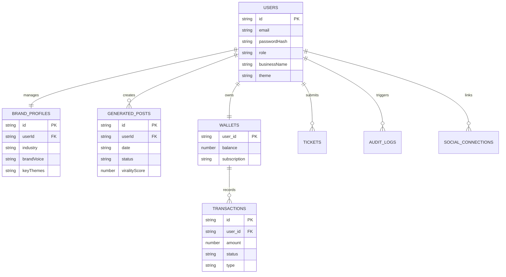

# Kawayan AI - Database Schema

[**⬅ Back: Architecture**](./ARCHITECTURE.md) | [**Next: Developer Guide ➔**](./DEVELOPER_GUIDE.md)

This document outlines the data structures (entities) used in the application's local database service.

## 1. User
Represents a registered account holder, administrator, or support staff.

| Field | Type | Description |
| :--- | :--- | :--- |
| `id` | `string` | Unique identifier (PK) |
| `email` | `string` | User's email address (Unique) |
| `passwordHash` | `string` | Hashed password for security |
| `role` | `'user' \| 'admin' \| 'support'` | Access level |
| `businessName` | `string` (optional) | Name of the user's business |
| `theme` | `'light' \| 'dark'` | UI theme preference |

## 2. BrandProfile
Stores the branding guidelines used by the AI to personalize content. Linked 1:1 with `User`.

| Field | Type | Description |
| :--- | :--- | :--- |
| `id` | `string` (optional) | Unique identifier |
| `userId` | `string` | Foreign Key to User |
| `businessName` | `string` | Display name of the brand |
| `industry` | `string` | e.g., "Food & Beverage", "Retail" |
| `targetAudience` | `string` | Demographic description |
| `brandVoice` | `string` | e.g., "Professional", "Makulit" |
| `keyThemes` | `string` | Core topics for content |
| `brandColors` | `string[]` | Array of HEX color codes |
| `contactEmail` | `string` | Public contact email |
| `contactPhone` | `string` | Public contact phone |

## 3. GeneratedPost
Represents a specific piece of social media content created by the AI.

| Field | Type | Description |
| :--- | :--- | :--- |
| `id` | `string` | Unique identifier |
| `userId` | `string` | Foreign Key to User |
| `date` | `string` (YYYY-MM-DD) | Scheduled date |
| `topic` | `string` | Main subject of the post |
| `caption` | `string` | The generated Taglish caption |
| `imagePrompt` | `string` | Prompt used for image generation |
| `imageUrl` | `string` (optional) | Base64 or URL of generated image |
| `status` | `'Draft' \| 'Scheduled' \| 'Published'` | Workflow status |
| `viralityScore` | `number` | AI-predicted score (0-100) |
| `viralityReason` | `string` | Explanation for the score |
| `format` | `string` | e.g., "Image", "Carousel" |
| `regenCount` | `number` | Count of regenerations (Max 2) |
| `history` | `PostVersion[]` | Array of previous drafts |

## 4. Wallet
Manages the user's financial balance and subscription state. Linked 1:1 with `User` (SQL Table: `wallets`).

| Field | Type | Description |
| :--- | :--- | :--- |
| `user_id` | `string` | Primary Key & Foreign Key to User |
| `balance` | `number` | Current prepaid credits (PHP) |
| `currency` | `string` | Default: "PHP" |
| `subscription` | `'FREE' \| 'PRO' \| 'ENTERPRISE'` | Current active plan |
| `updated_at` | `datetime` | Last modification timestamp |

## 5. Transaction
A specific financial record linked to a Wallet (SQL Table: `transactions`).

| Field | Type | Description |
| :--- | :--- | :--- |
| `id` | `string` | Unique Transaction ID (PK) |
| `user_id` | `string` | Foreign Key to Wallet |
| `date` | `datetime` | ISO Timestamp |
| `description` | `string` | e.g., "Wallet Top-up" |
| `amount` | `number` | Value in PHP |
| `status` | `'PENDING' \| 'COMPLETED' \| 'FAILED' \| 'CANCELLED'` | Payment status |
| `type` | `'CREDIT' \| 'DEBIT'` | Money in vs Money out |

## 6. Ticket
A support request submitted by a user.

| Field | Type | Description |
| :--- | :--- | :--- |
| `id` | `string` | Unique identifier |
| `ticketNum` | `number` | Human-readable ID (e.g., 1001) |
| `userId` | `string` | Foreign Key to User |
| `userEmail` | `string` | Contact email |
| `subject` | `string` | Issue summary |
| `priority` | `'Low' \| 'Medium' \| 'High' \| 'Critical'` | Urgency level |
| `status` | `'Open' \| 'Pending' \| 'Resolved'` | Current state |
| `createdAt` | `string` | ISO Timestamp |
| `messages` | `Message[]` | Chat history for this ticket |

## 7. AuditLog
System-wide activity logs for governance and security (SQL Table: `audit_logs`).

| Field | Type | Description |
| :--- | :--- | :--- |
| `id` | `string` | Unique Log ID (PK) |
| `user_id` | `string` | Foreign Key to User |
| `action` | `string` | Type of activity (e.g., "login", "create_post") |
| `details` | `string` | JSON or text details of the action |
| `timestamp` | `datetime` | ISO Timestamp |

## 8. SocialPlatformData
Stores the connection state and cached insights for social channels.

| Field | Type | Description |
| :--- | :--- | :--- |
| `platform` | `'facebook' \| 'instagram' \| 'tiktok'` | Network identifier |
| `connected` | `boolean` | Connection status |
| `followers` | `number` | Total follower count |
| `engagement` | `number` | Engagement rate percentage |
| `data` | `JSON` | Raw API response data |
| `updated_at` | `datetime` | Last sync timestamp |
