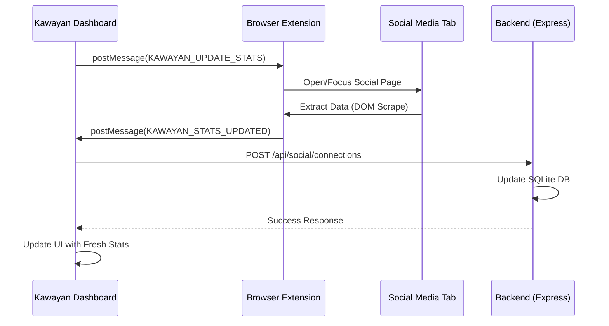

# Extension Guide (Kawayan Scraper)

[**⬅ Back: Testing Guide**](./TESTING_GUIDE.md) | [**Next: Local AI ➔**](./LOCAL_AI.md)

The Kawayan Browser Extension is a critical component that bridges the gap between the Kawayan AI Dashboard and social media platforms (Facebook, Instagram, TikTok).

## 1. Purpose
Due to API limitations and CORS restrictions, the extension acts as a "user-authorized scraper" to:

## 2. Structure
-   `manifest.json`: Defines permissions and content scripts.
-   `background.js`: Handles communication between content scripts and the Kawayan Dashboard.
-   `content_*.js`: Platform-specific scripts that extract data from the DOM.

## 3. Supported Platforms
-   **Facebook**: `content_facebook_insights.js`
-   **Instagram**: `content_instagram_insights.js`
-   **TikTok**: `content_tiktok_insights.js`

## 4. Data Flow
1.  User clicks **"Add Platform"** or **"Refresh"** in the Kawayan Dashboard.
2.  Dashboard sends a `window.postMessage` which is caught by the extension.
3.  The extension opens or targets the specific social media tab.
4.  The content script extracts relevant numbers (Followers, Likes, Views).
5.  Data is sent back to `background.js` and then relayed to the Dashboard via `postMessage`.
6.  The Dashboard calls `socialService.updateStats()` to persist the data in the SQLite DB.

---

## 5. Development
To load the extension during development:
1.  Open Chrome Extensions (`chrome://extensions/`).
2.  Enable **Developer mode**.
3.  Click **Load unpacked**.
4.  Select the `extension/` folder in the project root.
