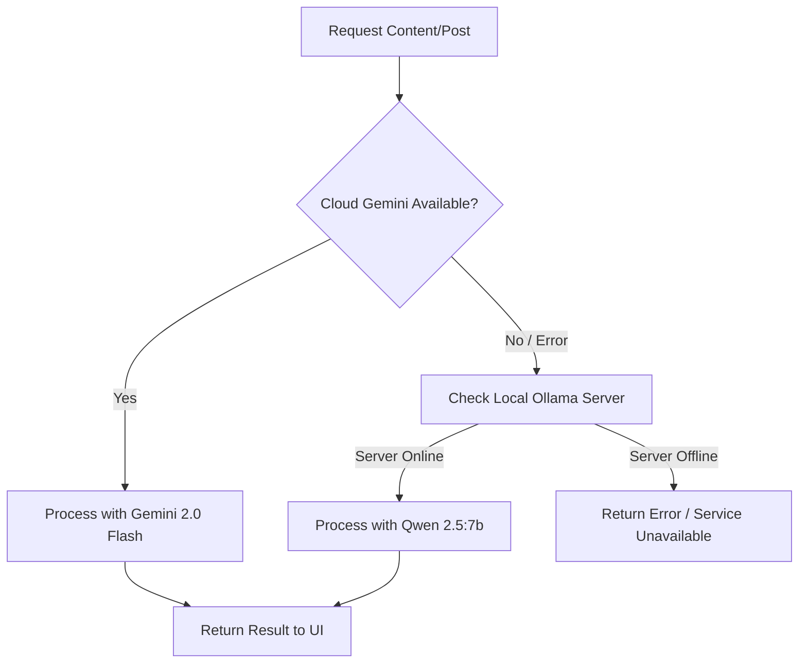

# Local AI Integration (Ollama)

[**⬅ Back: Extension Guide**](./EXTENSION_GUIDE.md) | [**Next: Developer Guide ➔**](./DEVELOPER_GUIDE.md)

Kawayan AI is designed with privacy and resilience in mind. While we prefer Google Gemini for high-performance generation, we provide a robust local fallback using Ollama.

## 1. Why Local AI?
-   **Privacy**: Sensitive brand data never leaves your local machine.
-   **Reliability**: Works offline or when Cloud API quotas are exceeded.
-   **Cost**: Unlimited generation at zero additional cost (compute only).



## 2. Setup Instructions
1.  **Install Ollama**: Download from [ollama.ai](https://ollama.ai/).
2.  **Pull the Model**:
    ```bash
    ollama pull qwen2.5:7b
    ```
    *Note: We recommend Qwen 2.5 as it handles multilingual/Taglish instructions very well.*
3.  **Run the Server**: Ensure Ollama is running (`ollama serve`).

## 3. Configuration
The `geminiService.ts` automatically detects if the local Ollama server is available at `http://127.0.0.1:11434`.

If a Cloud request fails, the system will:
1.  Log a "Falling back to local AI" warning.
2.  Re-format the prompt for the local model.
3.  Attempt generation via the local API.

## 4. Supported Features (Local)
-   **Content Planning**: Generates the weekly calendar JSON.
-   **Taglish Captions**: Handles basic Taglish nuances.
-   **Image Prompts**: Translates ideas into descriptive prompts for image generators.

---

## 5. Limitations
-   **Compute**: Speed depends on your GPU/CPU (Mac M-series or NVIDIA recommended).
-   **Logic**: While Qwen 2.5 is excellent, Gemini 2.0 Flash is generally more creative with complex "virality" reasoning.
